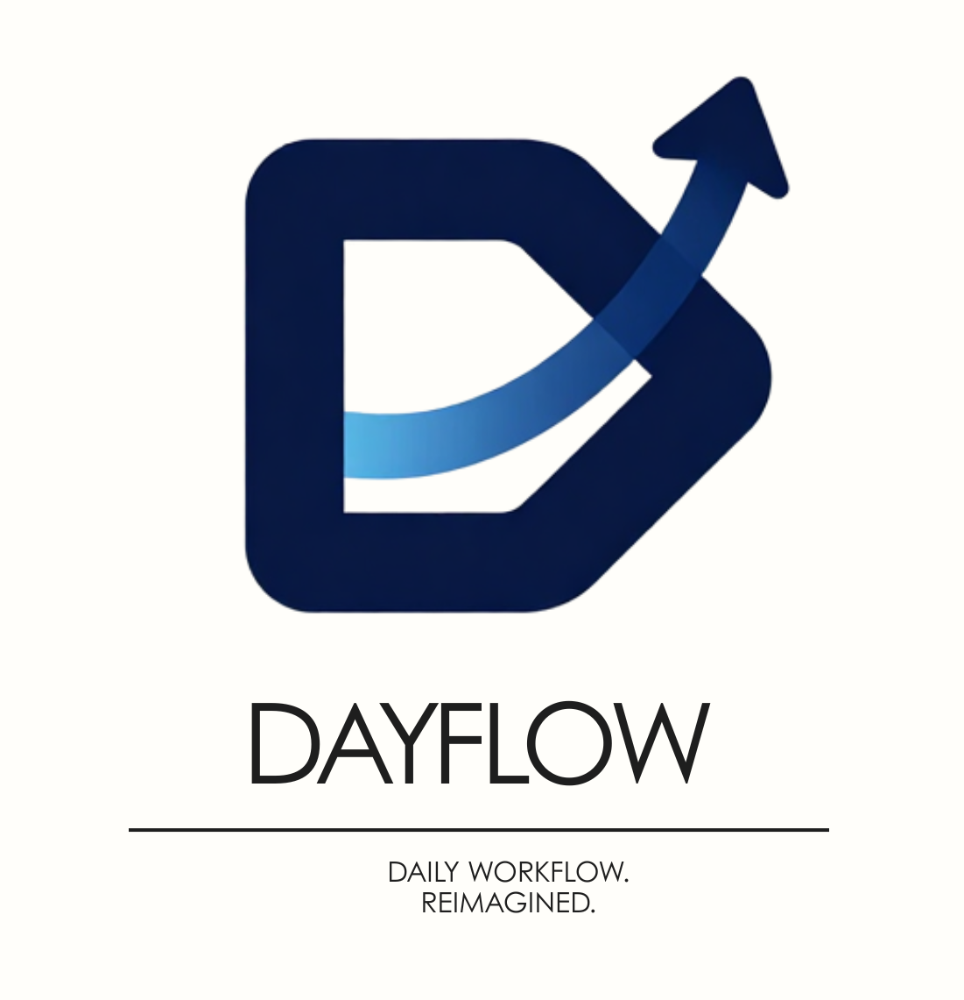

# DayFlow

## Project Overview
DayFlow is a Human Resource Management System designed to simplify and streamline core HR processes. It provides tools for managing employee records, tracking attendance, and processing time-off requests within a clean and intuitive interface. 

## Core Features
* **User Authentication:** Secure login and registration system with auto-generated, structured Employee IDs based on company name and joining date.
* **Employee Dashboard:** A central directory displaying employee cards with real-time visual status indicators (present, absent, or on leave).
* **Profile Management:** Detailed employee profiles for managing resumes, private information, and security settings.
* **Attendance Tracking:** Integrated check-in and check-out functionality that logs daily work hours and extra hours, featuring distinct views for individual employees and administrative oversight.
* **Automated Salary Management:** An admin-exclusive module to manage compensation, featuring automatic calculation of salary components (Basic, HRA, allowances, bonuses) and tax deductions (PF, Professional Tax) based on a defined fixed wage.
* **Time-Off Management:** A leave tracking system supporting multiple categories (Paid Time Off, Sick Leave, Unpaid Leaves) with a dedicated approval and rejection workflow for HR administrators.

## Contributors
* Khushi Sharma
* Chinmay Chavan
* Blyth D'souza
* Bhargav Kanitkar
